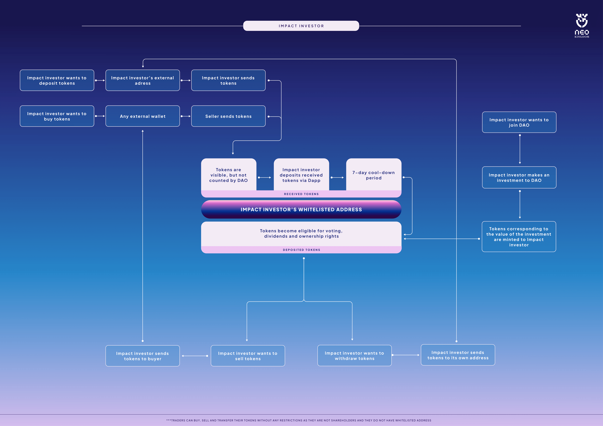

# Impact Investors

Any individual interested in participating in the NEOKingdom DAO as an Investor can submit their KYC and other relevant documents to the DAO. If the person is approved, they will be gifted 1 share of the NEOKingdom DAO.&#x20;

<figure><figcaption></figcaption></figure>

An Impact Investor or Regular Investor can freely transfer their tokens between blockchain addresses and dispose of them without any restrictions.

* they must be KYC-compliant and entered into the shareholders register;
* they can be natural persons or entities;
* they can invest money and receive NEOK in return;
* they have the right to vote on resolutions (based on the number of NEOK they hold);
* they have the right to receive profits (based on the number of NEOK they hold);
* they can sell NEOK on the secondary market whenever they want;
* their NEOK is taken into account while calculating the allotment of the NEOKingdom DAO ownership, governance, and dividend rights between all of its members.

### Voting&#x20;

Of the three types of shareholders, Impact Investors and Contributors can participate in DAO voting, meaning they can play a role in the governing of the DAO. Voting rights are not distributed evenly among the shareholders of DAO, but instead correlate to the amount of NEOK held by each voting-eligible shareholder.

An Impact Investor may delegate their voting right to a Contributor, or to another Impact Investor.

### Exiting

An Impact Investor can leave the DAO at any time, without any restrictions, by notifying the DAO and gifting back or selling back their share of the DAO at their nominal value of 1 Euro per share.

\
