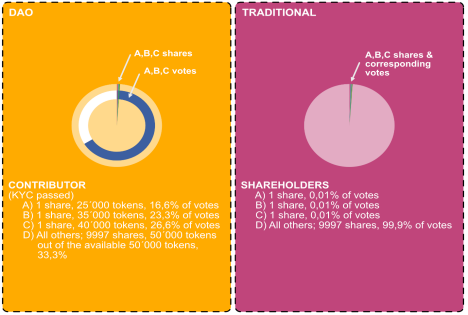
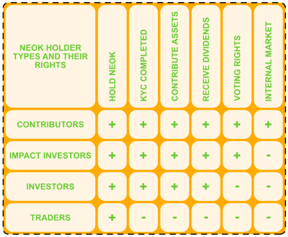
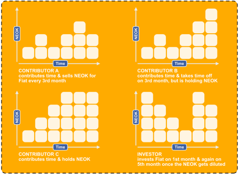
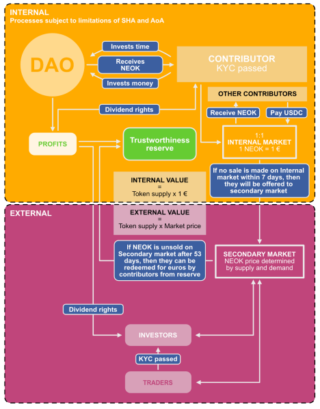

# NEOKingdom DAO tokenomics

NEOKingdom DAO tokenomics

Introduction

This summary gives a generalized overview of:


\- substance;

\- holder types;

\- minting;

\- benefiting;

\- valuating; and

\- disposing

of NEOKingdom DAO tokens (i.e. NEOK).

It serves the purpose of making the wider public understand the tokenomics of NEOK better in order to make a more educated decision about whether to acquire, hold or dispose of NEOK. A very simplified visual explanation of NEOK operational aspects is in Annex 1.

As a disclaimer, NEOKingdom DAO does not provide legal, tax, investment, financial, or other advice. This summary is for informational purposes only, you should not construe any such information as legal, tax, investment, financial, or other advice. Nothing contained here constitutes a solicitation, recommendation, endorsement, or offer to buy or sell NEOK. All information in this summary is information of a general nature and does not address the circumstances of any particular individual or entity. You alone assume the sole responsibility of evaluating the merits and risks associated with the use of any information here before making any decisions based on such information.

Business case of NEOKingdom DAO

Problem


In our current economy and corporate culture, exploitative behavior is dominant. Early investors, founders, and other shareholders often end up owning the main share of a company, while actual employees are rewarded with the possibility to work really hard. The less is paid to workers fostering the daily growth, the more remains for founders, investors, and other shareholders that often don’t add much to the continuous success other than initial monetary investments. However, we all have only one life to live and prosper.

Solution


The solution is to redefine the meaning of an investor. NEOKingdom DAO starts rewarding contributors with ownership, governance, and dividend rights on an equal basis, so they would also own part of what they create daily. Contributors may also choose to dispose of their rights, like other shareholders if they need fiat money for expenses or decide to leave the DAO. This creates a level playing field between contributors investing their time and founders, investors, and other shareholders investing their money.

Product


NEOKingdom DAO is developing the legal and technical framework (hereinafter: Framework) required to create and manage a new type of elevated organizations, which we call "neokingdoms." A neokingdom is a DAO wrapped into a limited liability company incorporated in Estonia that uses our tested custom Articles of Association, Shareholders' Agreement, and blockchain-based technical solution for governance. All members of a neokingdom are also the shareholders of a respective underlying private limited company.


The Framework is first developed and deployed at NEOKingdom DAO and then offered to neokingdoms with individualized modifications. The Framework is built on the Ethereum Virtual Machine (EVM) and is legally compliant. Within the Framework, DAO members can vote and interact with their DAO by using the progressive web app developed by NEOKingdom DAO.

To ensure the effectiveness of the proposed Framework, we have adopted it ourselves, testing it every day. On July 27th, 2022, the founders of NEOKingdom DAO transformed their existing brick-and-mortar company, teledisko GmbH, into the first neokingdom. We have been using this experience to refine the Framework to better address challenges and make the Framework available to every type of business in the future.

Currently, there are two active entities using the Framework: teledisko DAO OÜ, launched on July 27th, 2022, as a pilot project of the concept, and NEOKingdom DAO OÜ, launched in December 2022. There are 3-5 other companies in the pipeline to join the Framework as neokingdoms in 2023.

Revenue


NEOKingdom DAO provides the Framework to neokingdoms for the exchange of a share in them. Therefore, the success and profit of NEOKingdom DAO are directly connected to the success of all neokingdoms together (creating an ecosystem that we call NEOCommonwealth). It is important that even if a neokingdom does not earn profit and therefore does not pay dividends to NEOKingdom DAO, there will be a capital gain in case of a profitable exit of the neokingdom.

It is important to note that, while tested and already in production, many of the new concepts involved in the Framework are experimental, and the consequences and actual user behavior still need to stand the long-term test.

NEOK substance

NEOKingdom DAO is wrapped into a private limited company. Consequently, all of its members (i.e., KYC-compliant NEOK holders) are official shareholders of the underlying company. Each DAO member owns 1 share out of 10 000 shares, which corresponds to 0,01% of the share capital of the company thereof and is also inserted into the official shareholders register.

However, AoA and SHA of NEOKingdom DAO specify that the ownership, governance, and dividend rights of each shareholder are determined based on the number of NEOK they hold, not the number of shares they hold. Consequently, for the purpose of simplicity here, NEOK tokens seemingly substitute shares and determine instead the allotment of the NEOKingdom DAO ownership, governance, and dividend rights between all of its members in a legally compliant, sound, and enforceable way.

It is important to highlight that the specific rights and obligations of each NEOK holder depend on their classification, not the fact of holding NEOK, nor the number of them.


NEOK holder types

NEOKingdom DAO has four types of NEOK holders, each with different rights and obligations. This diverse holder base allows for an inclusive and thriving community that supports the growth and success of NEOKingdom DAO.

Holder types are divided between two major groups: KYC-compliant holders with access to core functionalities of the Framework, and generic holders, who hold tokens for trading purposes outside the Framework.

Contributors

They are the core members of NEOKingdom DAO. Their contributed time triggers the minting of NEOK, they have the widest rights as shareholders and also the most restrictions:

● they must be KYC-compliant and entered into the shareholders register;&#x20;

● they must be natural persons;

● they can contribute time and receive NEOK in return;

● they can invest money and receive NEOK in return;

● they can propose new resolutions for consideration by the DAO;&#x20;

● they have the right to vote on resolutions (based on the number of NEOK they hold);

● they have the right to receive profit (based on the number of NEOK they hold);&#x20;

● they have the right to buy NEOK from other contributors on the internal market with a fixed price of 1 NEOK = 1 EUR;

● they cannot sell NEOK on the secondary market without offering NEOK before to other contributors with a fixed price of 1 NEOK = 1 EUR;

● their NEOK is taken into account while calculating the allotment of the NEOKingdom DAO ownership, governance, and dividend rights between all of its members.

Investors

This holder type is the entry point for everyone interested in participating in NEOKingdom DAO:

● they must be KYC-compliant and entered into the shareholders register;&#x20;

● they can be natural persons or entities;

● they can invest money and receive NEOK in return;

● they have the right to receive profit (based on the number of NEOK they hold);&#x20;

● they can sell NEOK on the secondary market whenever they want;&#x20;

● their NEOK is taken into account while calculating the allotment of the

NEOKingdom DAO ownership and dividend rights, but not governance rights, between all of its members.

Impact Investors

Very rare and specifically negotiated persons whose investment has such an importance to NEOKingdom DAO that those persons have voting right although they are not contributors:

● they must be KYC-compliant and entered into the shareholders register;&#x20;

● they can be natural persons or entities;

● they can invest money and receive NEOK in return;

● they have the right to vote on resolutions (based on the number of NEOK they hold);

● they have the right to receive profits (based on the number of NEOK they hold);&#x20;

● they can sell NEOK on the secondary market whenever they want;&#x20;

● their NEOK is taken into account while calculating the allotment of the

NEOKingdom DAO ownership, governance, and dividend rights between all of its members.

Traders

Those are persons who have acquired NEOK for trading purposes from the secondary market and have no connection to NEOKingdom DAO (i.e., they are not DAO members or shareholders):

● they can apply to become investors;

● they can sell NEOK on the secondary market whenever they want;&#x20;

● their NEOK is not taken into account while calculating the allotment of the NEOKingdom DAO ownership, governance, or dividend rights between all of its members.

NEOK minting

Typically, NEOK is minted once a month, based on contributors’ time contributed to NEOKingdom DAO during the previous month. However, NEOK is also minted on an ad-hoc basis upon monetary or in-kind investments made to the DAO. There are no other grounds to mint NEOK, and NEOK is always directly minted to the person that contributed time or made the investment. There is no staking or reserve pool of NEOK, no predefined allocation between team/advisors/etc. or airdrops.

In practice, this means that the NEOKingdom DAO can mint NEOK only when there is value added to the DAO. Whether it be contributed time or funds/assets. Consequently, NEOK minting is continuous and happens always when value is added. There is neither an initial nor final NEOK supply. The number of NEOK in existence will keep increasing. This means the token supply can, in theory, increase infinitely. This fact raises the concern that existing token holders are diluted in the process.

It is essential to note that this dilution is not a flaw but a deliberate feature of NEOKingdom DAO and NEOK.

NEOKingdom DAO claims to challenge the status quo of how investment is perceived and value and success are shared. While at first view, it may seem unfair for early contributors or investors that they get diluted, the main reason for this feature is the assumption that the main growth and economic success of an organization are achieved at a later stage of the life cycle. For fairness towards those contributors who will generate growth and contribute to long-term success, the early contributors are the ones that need to be willing to share. The change in the status quo, that everyone involved in NEOKingdom DAO needs to be aware of, is that it no longer pays off to be early in the game and then be settled. On the other hand, founders, initial investors, and first contributors do not need founders’ agreements, reverse vesting contracts, and all those other instruments abused by start-ups and VCs at the moment – NEOK tokenomics will substitute all this with simple rules based on fairness, sharing and valuing lifetime.

The heroes of NEOKingdom DAO are the contributors. They are investing their lifetime, the most valuable asset and often under-appreciated. Contributors are always considered first and are the lifeblood of NEOKingdom DAO.

NEOK benefits

Benefits related to holding NEOK depend on the holder's classification: 1. Contributors will own a fair part of the business they are spending their time on. They also have the possibility to direct NEOKingdom DAO on a daily basis by voting on resolutions and earning dividends from annual profits. In case of a need for fiat money, they can decide to sell part of their ownership rights at any time. Upon market failure, contributors can redeem a limited number of NEOK against NEOKingdom DAO to pay for daily expenses;

2\. Investors will be entitled to dividends from annual profits and receive a capital gain if the price of NEOK rises. As NEOK gives access to ownership, an investor can evaluate the actual value that NEOKingdom DAO creates and make investment and NEOK price decisions on the secondary market based on that;

3\. Impact investors have the right to direct NEOKingdom DAO on a daily basis by voting on resolutions. They are also entitled to all the benefits of investors; 4. Traders have the possibility to make short or long-term investments into NEOK with the expectation to gain from the rise of NEOK price without any connection to NEOKingdom DAO.

In summary, NEOK is designed to create a diverse and thriving ecosystem that rewards mostly KYC-compliant holders for their time contributions, fosters active participation of investors, and encourages token trading from outsiders to support the growth and success of the DAO.

NEOK valuation

NEOK is accessible by anyone without limitations on the secondary market. Hence it is subject to classical token trading. Anyone can evaluate the value of NEOKingdom DAO, potential dividends, or any other metrics to determine NEOK price and trade it accordingly. This creates a scenario in which the NEOK price on the secondary market

can be different from the 1:1 ratio of 1 NEOK = 1EUR as it is treated in the internal market between contributors.

This creates a clear distinction between the INTERNAL VALUE of NEOKingdom DAO and the EXTERNAL VALUE of it:


\- Internal value = total NEOK supply x 1EUR;


\- External value = total NEOK supply x secondary market price.

While the internal value simply represents the total value that has ever been put into the NEOKingdom DAO by time or monetary contribution, the external value represents the evaluation of external parties of what has been created and its possible profits.

It needs to be understood that this is a very experimental approach, and it is uncertain how investors and contributors will act if the discrepancy between the internal and external value gets significant. This potential discrepancy is also not a flaw but a deliberate feature that serves as an incentive for contributors to hold their NEOK rather than dispose of them shortly after minting. Furthermore, it enforces the “contributors first” approach, as the contributors will benefit from being able to sell the tokens, which represent the value they have added to the DAO, to traders for a higher price. On the other hand, traders will only pay a higher price for NEOK if the NEOKingdom DAO is actually successful and valuable, which incentivizes contributors to perform.

NEOK disposal

NEOKingdom DAO AoA and SHA enforce a set of rules on the disposal of NEOK. Those rules depend on the holder's classification:

1\) Contributors are obliged to offer NEOK to other contributors with a fixed price of 1 NEOK = 1 EUR before offering NEOK to the secondary market. However, if a contributor is unable to sell NEOK on the secondary market too (i.e., the inner market between contributors and the secondary market are in failure), it has the right to redeem a limited number of NEOK against NEOKingdom DAO through a specific procedure. Such redeemed NEOK is burnt. NEOKingdom DAO will execute the payment from a Trustworthiness Reserve that is filled from annual profit;

2\) Investors, impact investors, and traders do not have the right to acquire tokens from contributors with a fixed price of 1 NEOK = 1 EUR, and they have no right to redeem NEOK against NEOKingdom also, but they have the freedom to sell their NEOK freely whenever they want with whatever price they want on the secondary market. There are no vesting or similar rules related to NEOK unless specifically negotiated with an impact investor.

This approach gives contributors a certain security against short-term market failures while preserving the classical logic that investors/traders bear more financial risk but also always have the possibility to exit at their chosen time with chosen price.

Annex 1

