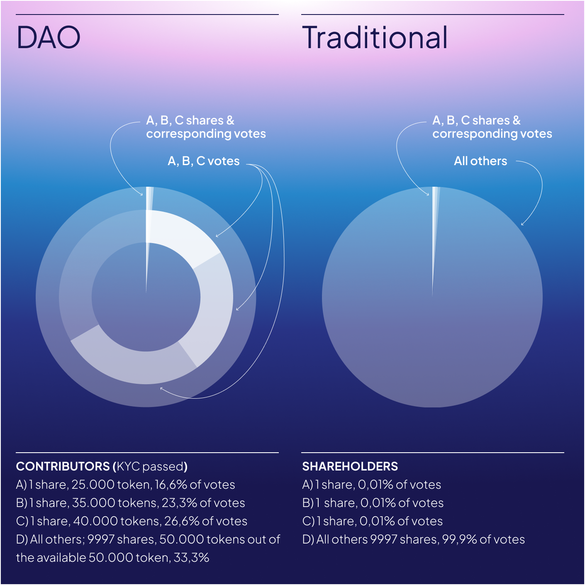

# Private Limited Company

NEOKingdom DAO is wrapped into a private limited company. Consequently, all of its members (i.e., KYC-compliant NEOK holders) are official shareholders of the underlying company. Each DAO member owns 1 share out of 10 000 shares, which corresponds to 0,01% of the share capital of the company thereof and is also inserted into the official shareholders register.

However, AoA and SHA of NEOKingdom DAO specify that the ownership, governance, and dividend rights of each shareholder are determined based on the number of NEOK they hold, not the number of shares they hold. Consequently, for the purpose of simplicity here, NEOK tokens seemingly substitute shares and determine instead the allotment of the NEOKingdom DAO ownership, governance, and dividend rights between all of its members in a legally compliant, sound, and enforceable way.

<figure><figcaption></figcaption></figure>

It is important to highlight that the specific rights and obligations of each NEOK holder depend on their classification, not the fact of holding NEOK, nor the number of them.

